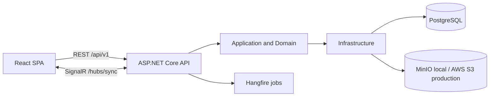

# FluentA

> A full-stack learning and productivity platform that combines vocabulary
> study, spaced repetition, and personal workflow management.

<p align="center">
  
</p>

[Overview](#overview) · [Features](#key-features) · [Architecture](#architecture) ·
[Getting Started](#getting-started) · [Documentation](#documentation)

## Overview

FluentA helps learners build vocabulary, practise with flashcards, and review
at the right time while managing the tasks and habits that support consistent
learning. It brings learning tools, personal planning, focus sessions, notes,
and progress tracking into one web application.

The repository contains a React single-page application and an ASP.NET Core
modular monolith. PostgreSQL is the durable store, process-local memory holds
short-lived state, SignalR synchronizes active sessions, private object storage
holds assets, and Hangfire runs recurring jobs. Development uses MinIO while
production uses AWS S3.

## Key Features

- Configurable vocabulary boards with multilingual columns and cell autosave.
- Synchronized flashcards, practice modes, review sessions, and spaced
  repetition scheduling.
- Daily and weekly todos, habit tracking, countdowns, Project, and Pomodoro.
- Rich-text journal entries, notes, notifications, and profile settings.
- Email/password authentication, account recovery, and Google OAuth.
- Realtime updates across authenticated browser sessions.

## Architecture



The backend keeps HTTP and realtime concerns in `FluentA.API`, use cases and
ports in `FluentA.Application`, business rules in `FluentA.Domain`, and
external service implementations in `FluentA.Infrastructure`. Controllers
share the API identity/error boundary, while bounded-context services keep
orchestration and delegate validation, mapping, statistics, and provider/query
hotspots to focused internal collaborators. See
[Architecture](docs/ARCHITECTURE.md) for boundaries, ownership, and runtime
flows.

## Tech Stack

| Area | Technologies |
| --- | --- |
| Frontend | React 19, TypeScript, Vite, React Router |
| Client state and data | TanStack Query, Zustand, Axios |
| Backend | ASP.NET Core, .NET 10, Entity Framework Core |
| Data and infrastructure | PostgreSQL 16, MinIO for local development, AWS S3 for production, Docker Compose |
| Realtime and jobs | SignalR, Hangfire |
| Testing | xUnit, Vitest, Playwright |

## Engineering Highlights

- Modular-monolith boundaries separate domain rules from delivery and
  infrastructure concerns.
- Internal decomposition keeps the existing four projects and public contracts;
  it does not introduce CQRS, MediatR, or one handler per endpoint.
- A consistent `ApiEnvelope<T>` contract keeps frontend and backend error
  handling predictable.
- SignalR events and query invalidation synchronize changes across active
  sessions.
- Server-authoritative scheduling drives spaced repetition, reminders, and
  productivity jobs.
- Unit and browser-level test suites cover business rules and critical user
  workflows.

## Getting Started

### Prerequisites

- Docker with Docker Compose
- A Google Identity Services Web client ID for Google login
- A Resend API key and verified sender for registration OTP/password reset
- An Azure Speech region and subscription key for pronunciation assessment

### Full local Docker stack

The packaged local runtime builds and starts the frontend, API/Hangfire,
automatic EF migration, a new PostgreSQL database, and private MinIO storage.
It does not use AWS services.

From the repository root:

```powershell
.\deploy\local\start.ps1 -Detach
```

On first run, enter the Google web client ID, Resend key/sender, and Azure
Speech region/key directly in the terminal. The script generates the remaining
local secrets in ignored
`deploy/local/.env`. Open `https://localhost:7443`; accept the local Caddy
certificate warning only for `localhost`. See
[the local Docker runbook](deploy/local/README.md) for status, logs, stop, and
database-reset commands.

### Host development workflow

Use this workflow when running the API and Vite directly for source-level
development. It additionally requires the .NET 10 SDK, Node.js, and npm.

#### 1. Install dependencies

Run from the repository root:

```powershell
dotnet restore src/backend/FluentA.slnx
npm --prefix src/frontend install
Copy-Item src/frontend/.env.example src/frontend/.env.local
```

#### 2. Start local infrastructure

```powershell
docker compose -f docker-compose.dev.yml up -d
```

This starts PostgreSQL, MinIO, and the local MinIO bucket bootstrap.
The FluentA development database is `fluenta_dev`, exposed on
`localhost:5432`, and persisted in the Docker volume
`fluenta-postgres-dev-data`.

#### 3. Apply database migrations

```powershell
dotnet tool restore
dotnet tool run dotnet-ef database update `
  --project src/backend/FluentA.Infrastructure `
  --startup-project src/backend/FluentA.API
```

#### 4. Start the API

```powershell
dotnet run --project src/backend/FluentA.API --launch-profile https
```

The API is available at `https://localhost:7000`; its development OpenAPI
document is at `https://localhost:7000/openapi/v1.json`.

#### 5. Start the frontend

Open another terminal at the repository root:

```powershell
npm --prefix src/frontend run dev
```

Open `https://localhost:5173`.

## Usage

1. Register a new account or sign in.
2. Create a vocabulary board and add the columns needed for the target
   language.
3. Add words and use the synchronized flashcards for practice or scheduled
   review.
4. Plan learning with todos, habits, Project, countdowns, and Pomodoro sessions.
5. Capture longer-form content in Journal or Notes and review reminders in the
   notification inbox.

## Testing

```powershell
# Backend tests
dotnet test src/backend/FluentA.slnx --configuration Release --no-restore

# Frontend checks
npm --prefix src/frontend run check:architecture
npm --prefix src/frontend run lint
npm --prefix src/frontend run test:run
npm --prefix src/frontend run build

# Backend release checks
dotnet build src/backend/FluentA.slnx --configuration Release --no-restore
dotnet tool run dotnet-ef migrations has-pending-model-changes `
  --project src/backend/FluentA.Infrastructure `
  --startup-project src/backend/FluentA.API `
  --configuration Release

# Browser tests require the local stack to be running
npm --prefix src/frontend run test:e2e
```

## Project Structure

```text
src/
  backend/
    FluentA.API/                 HTTP, authentication, and SignalR
    FluentA.Application/         Use cases and application ports
    FluentA.Domain/              Entities and business rules
    FluentA.Infrastructure/      Persistence and external providers
  frontend/
    src/app/                     Application shell and router
    src/features/                Feature-owned UI and data access
    src/shared/                  Shared components, types, and utilities
    e2e/                         Playwright scenarios
docs/
  product/                       Current product contracts
  plans/                         Active and completed execution plans
  stories/                       Story scope and validation evidence
  decisions/                     Architecture decision records
```

## Documentation

- [Frontend development guide](src/frontend/README.md)
- [Frontend architecture guide](src/frontend/ARCHITECTURE.md)
- [Backend and API guide](src/backend/README.md)
- [Local Docker runbook](deploy/local/README.md)
- [Production operations runbook](deploy/production/README.md)
- [System architecture](docs/ARCHITECTURE.md)
- [Documentation map](docs/README.md)
