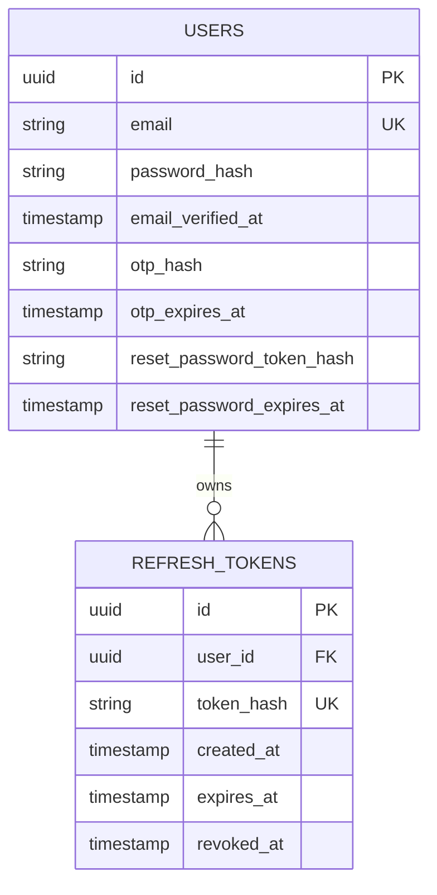
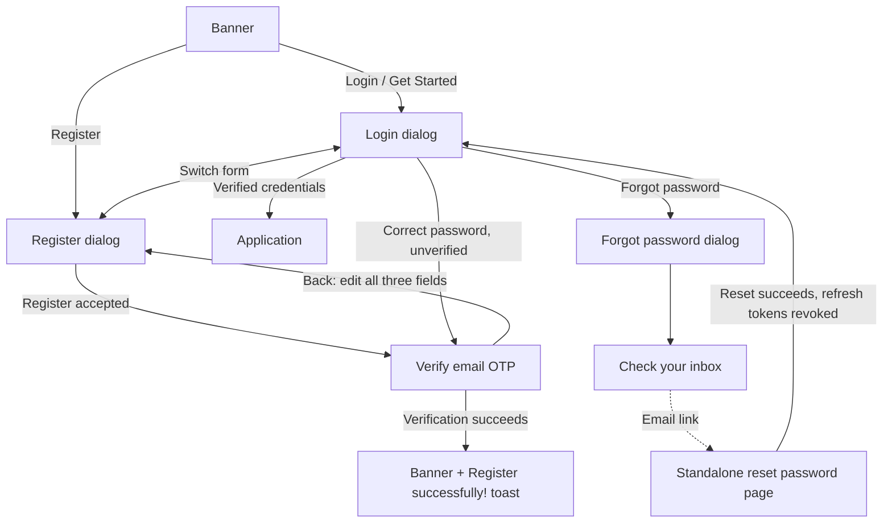
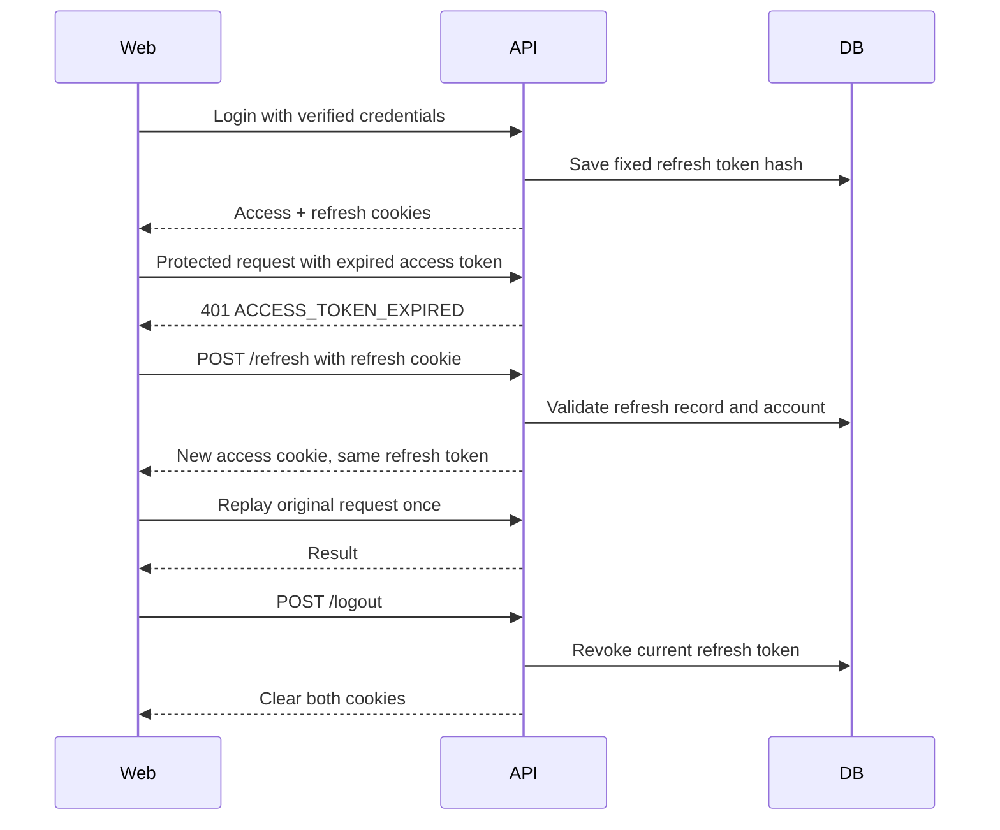

# Authentication

## Accepted behavior

The owner approved this contract on 2026-09-26. The web application uses a
five-minute JWT access token and a fixed, opaque refresh token with a seven-day
absolute lifetime. Refresh does not rotate or extend the refresh token.

Logout revokes only the current login's refresh token and clears both cookies.
A copied access JWT can still authorize requests until its expiry. No session
registry, per-request token revocation lookup or logout-all endpoint is required.
Password reset revokes all refresh tokens for that user, with the same remaining
access-token lifetime tradeoff.

## Database design



Existing `users` identity/profile fields remain. Auth-specific fields include:

| Column | Meaning |
| --- | --- |
| `password_hash` | Password hash; nullable for Google-only accounts |
| `email_verified_at` | Null until email verification |
| `otp_hash` | Email-bound verification OTP hash |
| `otp_expires_at` | OTP deadline, five minutes after issuance |
| `reset_password_token_hash` | Hash of independent password-reset token |
| `reset_password_expires_at` | Reset deadline, fifteen minutes after issuance |

Rename `otp_code` to `otp_hash` and `reset_password_token` to
`reset_password_token_hash` without dropping the existing hashes. Remove
`otp_failed_attempts` and `otp_resend_available_at`.

New `refresh_tokens` records have `id`, `user_id`, unique `token_hash`
(SHA-256 encoded as 64 hexadecimal characters),
`created_at`, `expires_at` and nullable `revoked_at`. Each successful login creates
one record. Two tabs sharing cookies use the same record. Refresh validates its
hash, expiry, revocation and account eligibility; it does not create another row.
Raw refresh tokens and access JWTs are not stored in these tables.

## Registration and verification



1. Banner Login and Get Started open Login. Register opens Register directly.
2. Register accepts email, full name and password. Normalize email consistently.
3. An absent email creates a pending user. An existing unverified email has its
   full name, password hash and OTP replaced. A verified account is never
   overwritten, including a concurrent verification/update race.
4. This overwrite behavior and its interference/account-prehijacking risk were
   explicitly accepted by the owner. Do not introduce `/registration` or require
   a continuation credential for this contract.
5. Display six OTP cells; submit once when six digits are entered or pasted.
   A failed submission must allow editing or explicit retry without a loop.
6. Back restores all three editable registration fields held in memory. Submit
   uses `/register` again. Changing email targets that email's registration; it
   does not rename a different user by ID. Closing clears sensitive form state.
7. Successful verification consumes the OTP atomically, closes the auth dialog,
   returns to the banner and shows exactly `Register successfully!`.
8. Verification alone does not issue access/refresh cookies. User logs in next.
9. Correct login credentials for an unverified user produce `VERIFY_EMAIL`, not
   application access. An incorrect password never grants the verification step.

## Password recovery

Forgot password has an account-safe response. Password-backed accounts may
recover their password even before verification; recovery does not implicitly
mark their email verified. Google-only accounts continue through Google login.

The email link opens the standalone reset-password page using the banner visual
style. Opening the page does not consume the token. A successful password update
atomically consumes the reset token and revokes all the user's refresh tokens.
Return to Login after success; do not automatically authenticate. A new reset
request replaces the previous reset token. OTP and reset-token purpose are separate.

## API contract

Base path: `/api/v1/auth`. JSON uses the existing `{ success, data, error }`
envelope. Tokens are cookie-only and are not included in response JSON.

| Method and path | Request | Success data / behavior |
| --- | --- | --- |
| `POST /register` | `email`, `password`, `fullName` | `nextStep: VERIFY_EMAIL`, email, verification expiry, message |
| `POST /verify-otp` | `email`, `otp` | `nextStep: REGISTERED`; no login cookies |
| `POST /resend-verification-otp` | `email` | Email, verification expiry, message |
| `POST /login` | `email`, `password` | `AUTHENTICATED` + minimal user + access expiry, or `VERIFY_EMAIL` + email + OTP expiry |
| `POST /google` | `idToken` | Same authenticated outcome as Login |
| `POST /refresh` | Empty; refresh cookie | Access expiry; only access cookie replaced |
| `POST /logout` | Empty; refresh cookie | Revoke current refresh, clear cookies; idempotent |
| `GET /me` | Access cookie | Only `id`, `fullName`, `avatarUrl` |
| `POST /forgot-password` | `email` | Consistent account-safe message |
| `POST /reset-password` | `token`, `newPassword` | `nextStep: LOGIN`, success message |

Register returns HTTP 201 for both creation and replacement of an unverified
registration. Other successful endpoints above return HTTP 200. Validation
failures from application rules return 422; malformed or missing required JSON
values rejected by MVC return 400 with the same envelope. Invalid credentials/tokens
return 401; an existing verified
email or incompatible Google account returns 409. Cookie-origin rejection returns
403. Mail delivery failure during registration/resend returns 503 and leaves the
pending registration available for another registration or resend attempt.

`/google` replaces `/google-login`. No `/registration`, `/logout-all` or new
profile-read endpoint is added. Existing settings/profile operations retain their
full profile contract; `/me` is only the initial authenticated principal summary.

Access-token failures distinguish `ACCESS_TOKEN_EXPIRED`,
`AUTHENTICATION_REQUIRED` and `ACCESS_TOKEN_INVALID`. An unusable refresh token
returns `REFRESH_TOKEN_INVALID`. Validation and business errors retain the
existing envelope and field details. Rate-limited responses remain HTTP 429 with
`Retry-After` and `error.details.retryAfterSeconds`.

## Browser behavior

### Figma reference

The auth UI follows file `aXpNdha5kLTa9qbfElM3Et`, inspected directly on
2026-09-27: Login `13:2`, Register `24:2`, Forgot password `24:48`, Verify email
OTP `26:2`, and Reset password `27:79`. Dialogs use a 520px maximum width,
24px corners and 44px desktop horizontal padding. All auth dialogs use `#F4FAF9`
per the owner's follow-up; banner Login/Register pills are white with dark text,
and auth action hover backgrounds use the banner's teal `#00ADA4`;
the standalone reset page uses the banner's `#F0FAFA` background with the form
directly on it. OTP has a top-left Back control, six cells and inline resend.

The Register submit button is retained although absent from the reference frame.
Browser password autocomplete keeps the agreed password-manager behavior; there
is no checkbox that changes token lifetime or stores passwords in application
storage. The reference's OTP countdown is illustrative: show a countdown only
when the API actually supplies a retry deadline.



Cookie credentials are HttpOnly, Secure and SameSite Strict. Cookies must be
cleared using their original path/domain options. Auth responses must not be
cached. Keep server-side origin/CSRF protections appropriate to cookie mutations.
Login, Google login, refresh and logout require an `Origin` header matching the
configured frontend origins. Browser requests supply it automatically; API tools
must supply the intended frontend origin explicitly.
Passwords are never persisted by application code; normal browser autocomplete
is supported without a Remember me checkbox controlling token lifetime.

On startup, `/me` restores the principal. An eligible expired/missing access
token response triggers one refresh and one replay. Concurrent requests within a
tab share the refresh operation. Login, Google, refresh and password-recovery
errors do not recursively trigger refresh. Network errors are not treated as
proof of revoked authentication. Logout prevents late refresh responses from
restoring the authenticated UI and clears cached private data.

Fixed refresh tokens permit concurrent refresh requests; no rotation-specific
Web Locks protocol is required. Backend refresh, logout and password-reset
operations must serialize their state checks against revocation.

Realtime connections must not retain authentication indefinitely after JWT
expiry; reconnect must cooperate with refresh rather than repeatedly retry an
expired cookie.

## Deferred rate-limiting work

The owner explicitly deferred the redesigned account-scoped limiter. Existing
IP-based middleware remains; no new database-backed or distributed limiter is
introduced. Removing User counters/cooldowns removes their former five-failed-
attempt invalidation and thirty-second per-user resend restriction. This is a
known protection gap until that follow-up is implemented. Frontend must honor
actual HTTP 429 retry metadata, not invent a per-user cooldown.

## Deployment and proof boundary

Schema migrations are delivered for review and application by the deployment
workflow; this task does not apply migrations to the user's database. A data
backup is needed to recover removed attempt/cooldown values. Existing seven-day
JWT cookies must be rejected at cutover rather than inheriting their old expiry;
users may need to log in again. New tokens carry an authentication-contract
version marker; validation rejects tokens without that marker. This cutover does
not require changing secrets or modifying the deployment's signing key.

The migration is `20260926143655_AuthAccessRefresh`. Deploy the matching API and
frontend together after the schema update. From the repository root, the existing
backend migration command is:

```powershell
dotnet tool run dotnet-ef database update `
  --project src/backend/FluentA.Infrastructure `
  --startup-project src/backend/FluentA.API
```

The design-time factory reads `FLUENTA_POSTGRES`; set it to the intended database
connection through the deployment's secret/configuration mechanism before running
this command. Use the deployment's backup procedure. Rolling back
the migration drops refresh records and recreates removed limiter fields with
defaults; it cannot recover their former values.

Compilation and review do not prove live cookie transport, email delivery,
database concurrency, migration execution or browser behavior. See the execution
plan for the actual validation performed.
